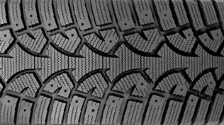
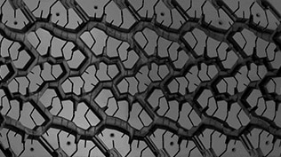
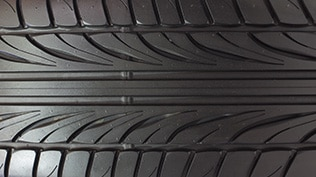
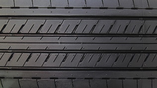
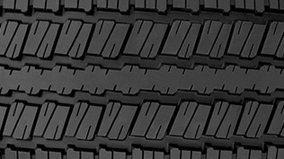
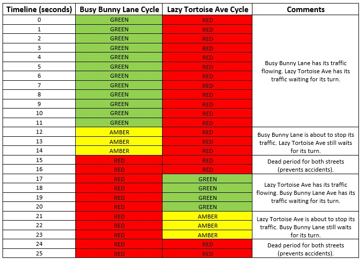
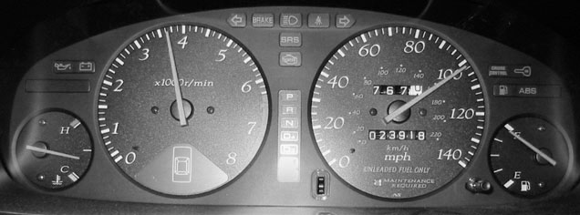

# Beginner Driver Education Homelink

Ru Zhang

## 1. Road User Behavior Observation

### a. What are the sequence of traffic light durations?

For one side of a four way intersection, the sequence of traffic
lights are the following: 1) left turn green (about 10s), 2) left turn
yellow (2\~3s), 3) four way red (2\~3s), 4) straight green (about 15s), 
5) straight yellow (2\~3s), 6) red (about 30s).

### b. What is the duration of the four way red before the green light?

The four way red is about 3s to 4s.

### c. What is the purpose of this sequencing?

The left turn green goes first to ensure the left turn traffic do not
block the opposite straight traffic. The left turn yellow provides
warning of the left turn red light. The four way red light ensures
that the intersection is clear before the green light for the straight
traffic. The straight green is longer than the left turn greens since
there are more straight traffic. 

### d. Similarly what are the sequences of the left turn arrow lights? 

For one way, the left arrow light follows this order: 1) green for
about 10s, 2) yellow for 2s to 3s, 3) red for about 60s. 

### e. Are there amber left turn arrow lights?

Yes

### f. How many drivers run yellow lights?

It is very common, 9 drivers run the yellow light in the 10 minutes
observation. 

### g. How many drivers run red lights?

It is rare, I did not observe any driver runs the red lights.

### h. How many drivers make improper right turns on a protected left turn? 

This is not very common, 2 improper right turns in the 10 minutes
observation.

### i. Armed with the knowledge of your observation, how would you deal with this intersection while executing a left turn?

I will follow the following three principles: 1) when the left turn
arrow light is green, go through the intersection quickly; 2) when
the arrow light turns yellow and if I am safe to stop, I will stop,
otherwise finish the left turn quickly; 3) always watch for the
improper right turns at the finishing stage of the left turn.

### j. What types of pedestrian lights are used at the intersection Pictograph walking man or hand in stop position? Countdown crossing timer?
	
It is the pictograph walking man for about 5 seconds and then becomes
a timer for 15 seconds.

### k. What are the advantages and disadvantages of each type?

The pictograph walking man is easy to understand especially for the
kids, but the pedestrians cannot see how many seconds left for them to
cross. The hand light provide warnings for the pedestrians to move
quickly and cautiously, but it does not provide the information of the
time as well. The timer light informs the pedestrians the time left
but not as straightforward as the pictograph walking man. 

### l. Do you know what is scrambled intersection? Would this intersection benefit from one?
	
This intersection is much safer for the pedestrians especially in the
school zone. 

### m. How many pedestrians disobey the traffic?

Many pedestrians disobey the traffic, at my observation, 13
pedestrians come by and 5 of them run for the red light.

### n. Armed with the knowledge of your observation how would you deal with errant pedestrians?
	
I will not expect the pedestrians obey the traffic lights and always
prepare for the errant ones. So I will slow down when I see
pedestrians about to come even it is a red light for them. 

### o. What are these signs? List them all.

In the intersection I observed, there are four type of signs: 1) yield
sign, 2) keep to the right of the traffic island, 3) hazard close to
the edge of the road, 4) information sign for the 417 highway
entrance.

### p. Are they easy or difficult to recognize? Is the intersection "sign busy" making the observation distracting?

They are easy to recognize. Since there are only four type of signs,
it is neither "sign busy" nor distracting.

### q. How would you deal with the information presented to you?

If I am sure about which way I should go, I will ignore the
information sign otherwise pay attention to it. I will pay most
attention to the regulation signs such as the stop sign and the yield
sign. It is easy to infer the information provided by the warning
signs such as the traffic island sign and hazard sign by the sight of
the road at day time. Therefore these warning signs are not as
important at day time as at night. 

### r. Are the buildings and businesses on the four corners distracting?

They are not very distracting at the intersection I observed since the
buildings are not high and keep a good distance from the road. 

## 2. Vehicle Behavior Observation

After engaging "D", not touching the gas pedal and letting go the wheel, the car starts and moves straight forward in constant speed. It is because the started engine propels the vehicle forward. Since the wheels are straight and the ground is flat, there is no force to push the car out of the straight line.

After doing the tight left turn, the car turns to the left. It is because the front wheels turn to the left and guide the car to the left.

After releasing the steering wheel, the car stops turning left and goes straight forward. Because when the car goes forward and the front wheels turn to the left, there is a friction on the front wheels pointing to the forward left. Since there is a cast angle on the front wheel, the pivot point of the front wheel is in front of the point where the front wheels receives the friction. Therefore, the friction forces the front wheels returning to the straight position. So the car goes straight forward.

After a left turn backward, the tail of the car turns to the back left. It is because the front wheels turn to the left and they rotate backward. So they guide the car turning to the left.

After releasing the steering wheel, the car keep turning left. Because when the car goes backward and the front wheels turn to the left, there is a friction on the front wheels pointing to the backward right. This friction forces the front wheel keep turning to the left.

## 3. Tires, Their Purpose and Behavior

### Awareness of the construction of a tire

According to the [Wiki page](https://en.wikipedia.org/wiki/Tire), the materials of modern pneumatic tires are synthetic rubber, natural rubber, fabric and wire, along with carbon black and other chemical compounds. Typicall, tires consist of the following components:

1. **tread**: the part of the tire that comes in contact with the road surface,
2. **bead**: the part of the tire that contacts the rim on the wheel,
3. **sidewall**: the part of the tire that bridges between the tread and the bead,
4. **shoulder**: the part of the tire at the edge of the tread as it makes transition to the sidewall,
5. **piles**: layers of of relatively inextensible cords embedded in the rubber to hold its shape by preventing the rubber from stretching in response to the internal pressure.

The following figure illustrates the construction of a tire.

### Awareness of the different types of tires and their purpose

There are several different type of tires

1. **snow/winter tires**: designed for increase traction on snow and ice covered roads,

2. **all terrain tires**: provide good performance on most road surfaces, in most weather conditions, and for off-road driving,

3. **performance tires**: designed for enhanced handling under demanding circumstances and generally have high-speed ratings with a low aspect ratio for improved control,

4. **summer only tires**:  they have a special tread and compound that are optimized for maximum dry- and wet-road performance,

5. **run-flat tires**: run-flat tires can be driven short distances at a moderate speed with no air pressure. There is no need to immediately stop to change the tire.

### Awareness of how proper maintenance is a safety factor

The following actions should be taken for proper maintenance of the tires:

1. **proper inflation**: the tires should be inflated to the recommended pressure provided by the manufacturer. Overinflation may increase the wear on the center contact patch, and underinflation will cause a concave tread, resulting in less center contact, though the overall contact patch will still be larger.

2. **rotation**: tire rotation is moving the tires to different car positions, such as front-to-rear, in order to even out the wear, with the objective of extending the life of the tire.

3. **wheel alignment**:  wheel alignment is the procedure for checking and correcting this condition through adjustment of camber, caster and toe angles. It helps prevent wear of tires by having the tire rotate in a direction, other than the path of the vehicle. 

## 4. Automobile Lights, Their History, Purpose and Behavior

In Ontario, it is required by law that all motor vehicles have a minimum two and a maximum of four white or amber lights to the front and a minimum of one red light to the rear. It is an offense to have one of the headlights out. The headlights must be capable of operating in a high and low beam capacity.

The lighting system of an automobile lights the roadway for the driver and increases the visibility of the vehicle, allowing other drivers and pedestrians to see the vehicle's presence, position, size direction of travel and the driver's intentions regarding direction and speed of travel.

There are several categories of automobile lights:

1. **headlight**: a lamp attached to the front of a vehicle to illuminate the road ahead. There are two modes of the headlight,
- low beam: it provides a light distribution to give adequate forward and lateral illumination without dazzling other road users with excessive glare.
- hight beam: it provides an intense, center-weighted distribution of light with no particular control of glare. It is suitable for use when alone on the road.

2. **auxiliary lamps**: there are typically two types of auxiliary lamps on a civilian passenger car, driving lamps, which provide hight intensity lights to enable the driver to see at longer range than the vehicle's high beam, and front fog lamps, which is designed for the condition of low visibility due to rain, fog, dust or snow.

3. **side marker and reflectors**: side-facing devices make the presence, position and direction of travel clearly visible from oblique angles.

4. **turn signals**: blinking lamps mounted near the front and rear corners of a vehicle and sometimes on the sides or on the side mirrors. They indicate the intention to turn or change the lane. 

5. **rear position lamps**: they provide conspicuity for the rear of a vehicle. They are required to produce red light and to be wired such that they are lit whenever the front position lamps are lit. 

6. **stop lamps**: they are steady burning rear lights, brighter than the rear position lamps. They are activated when the driver applies the vehicle's brakes. 

## 5. Traffic Lights, Their History, Purpose and Behavior

The world's first traffic light was a manually operated gas-lit signal installed in London in Dec. 1868. The first automatic traffic control system was patented in 1910 in Chicago. Traffic lights alternate the right of way accorded to users by illuminating lamps or LEDs of standard colours (red, amber (yellow), and green) following a universal colour code.

The color scheme of the traffic lights derives from a system used by the rail road. The red is chosen for stop since red has for centuries been used to indicate danger. The red color has the longest wavelength of any color on the visible spectrum, meaning people can see it from a greater distance than other colors. The white color was originally chosen for "all-clear" but it is easily confused with the glaring stars and causing accidents. So white is replace by green since green has the longest wavelength except for red and yellow. The yellow color is chosen for "caution" since it is very distinct from the other two colors and serves as a transition from green to red.

The traffic lights in Ontario operates as follows:

1. **green light**: you may turn left, go straight or turn right after yielding to vehicles and pedestrians already in the intersection. When turning left or right you must yield the right-of-way to pedestrians crossing the intersection.

2. **yellow light**: means the red light is about to appear. You must stop if you can do so safely; otherwise, go with caution.

3. **red light**: means you must stop and wait until the light changes to green and the intersection is clear clear before moving through it. Unless a sign tells you not to, you may turn right on a red light only after coming to a complete stop and waiting until the way is clear. You may also turn left on a red light if you are moving from a one-way road onto a one-way road, but you must come to a complete stop first and wait until the way is clear.

The sequence and timing scheme of a typically traffic light system is shown in the figure below. Assume the two roads of the intersection are named "Busy Bunny Lane" and "Lazy Tortoise Ave.", respectively.

The color blind people are allowed to obtain a driving licence provided that they can pass a test of memorizing the relative positions of the traffic lights. 

## 6. Vehicle Ergonomics

The mirrors of a car are adjusted in the following steps:

1. Sit in the driver's seat and position the seat and steering wheel so that you are comfortable and have access to the gear shifter, brake pedal, and accelerator. 

2. Gently maneuver the rear view mirror so that you can see directly out of the middle of your back windshield without moving your head. 

3. Adjust the driver’s side mirror. Make adjustments then sit back in the driver’s seat to ensure that you can see the road behind you and a small sliver of the side of your car.

4. Adjust the passenger side mirror. If you have to adjust it manually, you may need to move between the passenger’s and driver’s seats until it is properly adjusted.

5. After all mirrors have been adjusted, sit in the driver’s seat and look in each, starting with the driver’s side mirror. You should view everything behind you in segments as you glance along.

There are three major locations for for car controls. 

1. **Steering wheel controls**: include steering wheel, wind screen wipers, indicator lights, headlights on high and low beam, horn and cruise control. 

2. **Floor controls**: include accelerator pedal (right foot), brake pedal (right foot), clutch pedal (left foot, for manual transmission cars), gear lever (right hand) and parking brake (right hand)

3. **Console controls**: include ignition, hazard warning lights, heat controls, air conditioning controls, rear demister and airbag deactivator.

The following image shows the placement of the instrument cluster

The two main instruments are the speedometer (right) shows the speed of the car in both kilometers per hour and miles per hour and the tachometer (left) indicates the speed of the engine in the unit of 1000 rounds per minutes. The small round instrument on the left of tachometer indicates the temperature of the engine. Right most of the dashboard is the fuel level indicator. On the central top of the dashboard, there are four indicators showing the left turning lamp, brake lamp, high beam lamp, seat belt warning, and right turn lamp, respectively. The odometer lies inside the speedometer shows that this car has travelled for 23,918 kilometers.

## 7. AutoSmart -- A New Point of View

### a. Greenhouse gas and climate change

Carbon dioxide is called a greenhouse gas because it absorbs and emits radiant energy within the thermal infrared range and causes the greenhouse effect which warms up the surface of earth and lead to climate change. The potential consequences of climate changes includes 1) frost free season will lengthen, 2) changes in precipitation patterns, 3) more droughts and heat waves, 4) stronger hurricanes, 5) sea level rise, 6) arctic likely to become ice-free. 

### b. Fuel efficient driving

There are five fuel efficient driving techniques suggested by Natural Resource Canada: 1) accelerate gently, 2) maintain a steady speed, 3) anticipate traffic, 4) avoid high speeds, 5) coast to decelerate. 

Fuel efficient driving reduces the emission of green house gas therefore contributes to the protection from climate change. It also benefit the driver in the following ways 1) saves hundreds of dollars in fuel every year, 2) improves road safety, 3) prevents wear on the vehicle. 

### c. The importance of proper maintenance

It is suggested that the car is serviced every year or every 12,000 miles travelled, whichever comes first. 

The suggested tire pressure can be found on on a sticker in the door jamb, or in the owner's manual. Some models place the stickers on the trunk lid, in the console or on the fuel door. 

The checklist of items for vehicle maintenance: 1) fluids, include engine oil, coolant, transmission oil, e.t.c. 2) wipers, should be changed every year, 3) lights, ensure all of them work, 4) battery, watch for corrosion at the battery terminal, 5) tires, maintain proper pressure,
6) filters, should be replace when they are dirty. 

The checklist for preparation of winter driving: 1) install winter tire, 2) get the car ready with a maintenance check up, 3) change the wiper blades to winter blades, 4) clear snow and ice from all windows, lights, mirrors, hood and roof, 5) make sure the windshield washer reservoir is full, 6) keep the gas tank topped up. 

### d. Choosing the right vehicle for your everyday need

The places to find out the fuel efficiency about a vehicle: 1) the energuide label of a new vehicle, 2) from websites like vehicles.nrcan.gc.ca 3) manufacture's website. 

The technologies that reduce the emissions: 1) hybrid cars, 2) diesel powered vehicles, 3) electric vehicles. 

The questions should be asked before buying a vehicle: 1) who are you, 2) where do you live, 3) what do you do, 4) how do you spend your time, 5) how many people and things to carry, 6) how much traveling.

## 8. OK, Now I Have My G License, Why Should I Bother to Learn More

Benefits of the G License: 1) it does not expire, 2) lower insurance rates, 3) ability to drive without passenger and other restrictions.

Responsibilities attached to G license: 1) obey the traffic laws and driving practices, 2) care about the safety of others on the road, 3) co-operate with other road users to keep traffic moving safely, 4) be able to see dangerous situations before they happen and respond quickly and effectively to prevent them. 
